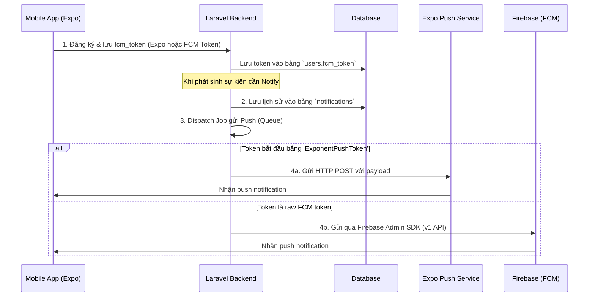

# Hướng dẫn Tích hợp Firebase (FCM) & Expo Push Notification trong Laravel

Tài liệu này hướng dẫn cách triển khai hệ thống gửi Push Notification bằng Laravel, tương thích hoàn toàn với cơ sở dữ liệu hiện tại của hệ thống. Hệ thống hỗ trợ cả thiết bị sử dụng **Expo Push Token** (dành cho app React Native) và **FCM Token** (Firebase Cloud Messaging).

---

## 1. Kiến trúc & Luồng hoạt động



---

## 2. Thiết lập Database & Laravel Models

Hệ thống notification cần lưu lại lịch sử hiển thị trên app (đọc/chưa đọc) và thông tin thiết bị (`fcm_token`).

### 2.1. Tạo Migrations

Chạy lệnh tạo migrations:
```bash
php artisan make:migration add_fcm_token_to_users_table --table=users
php artisan make:migration create_notifications_table
```

#### Migration `add_fcm_token_to_users_table`:
```php
<?php

use Illuminate\Database\Migrations\Migration;
use Illuminate\Database\Schema\Blueprint;
use Illuminate\Support\Facades\Schema;

return new class extends Migration
{
    public function up(): void
    {
        Schema::table('users', function (Blueprint $table) {
            // Thêm trường fcm_token để lưu Expo Token hoặc FCM Token của user
            $table->string('fcm_token')->nullable()->after('password');
        });
    }

    public function down(): void
    {
        Schema::table('users', function (Blueprint $table) {
            $table->dropColumn('fcm_token');
        });
    }
};
```

#### Migration `create_notifications_table`:
```php
<?php

use Illuminate\Database\Migrations\Migration;
use Illuminate\Database\Schema\Blueprint;
use Illuminate\Support\Facades\Schema;

return new class extends Migration
{
    public function up(): void
    {
        Schema::create('notifications', function (Blueprint $table) {
            // Sử dụng UUID làm khoá chính giống hệ thống hiện tại
            $table->uuid('id')->primary();
            
            // Liên kết với user
            $table->string('user_id'); // Hoặc $table->foreignUuid('user_id') tùy cấu trúc bảng users
            
            // Loại thông báo (PASSWORD_CHANGED, BOOKING_CREATED, etc.)
            $table->string('type'); 
            
            // Nội dung
            $table->string('title');
            $table->text('message');
            $table->boolean('is_read')->default(false);
            
            // Tham chiếu sang tour/booking để FE điều hướng
            $table->string('ref_id')->nullable();   // UUID của Tour hoặc Booking
            $table->string('ref_type')->nullable(); // Ví dụ: "TOUR", "DEPARTURE", "BOOKING"
            
            $table->timestamps();

            // Thiết lập khoá ngoại và index để tăng hiệu năng query
            $table->foreign('user_id')->references('id')->on('users')->onDelete('cascade');
            $table->index('user_id');
            $table->index('is_read');
        });
    }

    public function down(): void
    {
        Schema::dropIfExists('notifications');
    }
};
```

---

### 2.2. Tạo Eloquent Models

#### Model `User` (`app/Models/User.php`)
```php
<?php

namespace App\Models;

use Illuminate\Foundation\Auth\User as Authenticatable;
use Illuminate\Database\Eloquent\Relations\HasMany;

class User extends Authenticatable
{
    protected $fillable = [
        'first_name',
        'last_name',
        'email',
        'password',
        'fcm_token', // Cần điền vào fillable
    ];

    /**
     * Lấy danh sách thông báo của User
     */
    public function customNotifications(): HasMany
    {
        return $this->hasMany(Notification::class, 'user_id', 'id')->orderBy('created_at', 'desc');
    }
}
```

#### Model `Notification` (`app/Models/Notification.php`)
```php
<?php

namespace App\Models;

use Illuminate\Database\Eloquent\Model;
use Illuminate\Database\Eloquent\Relations\BelongsTo;
use Illuminate\Support\Str;

class Notification extends Model
{
    // Cấu hình khoá chính là UUID và không tự động tăng (non-incrementing)
    protected $keyType = 'string';
    public $incrementing = false;

    protected $fillable = [
        'user_id',
        'type',
        'title',
        'message',
        'is_read',
        'ref_id',
        'ref_type',
    ];

    protected $casts = [
        'is_read' => 'boolean',
    ];

    /**
     * Tự động sinh UUID khi tạo mới bản ghi
     */
    protected static function boot()
    {
        parent::boot();
        static::creating(function ($model) {
            if (empty($model->{$model->getKeyName()})) {
                $model->{$model->getKeyName()} = (string) Str::uuid();
            }
        });
    }

    /**
     * Quan hệ ngược lại với User
     */
    public function user(): BelongsTo
    {
        return $this->belongsTo(User::class, 'user_id', 'id');
    }
}
```

---

## 3. Tích hợp Firebase Admin SDK & Cấu hình Laravel

### 3.1. Cài đặt SDK Firebase của Kreait
Package này là chuẩn mực nhất khi làm việc với Firebase trong Laravel. Cài đặt bằng Composer:

```bash
composer require kreait/laravel-firebase
```

### 3.2. Cài đặt Service Account Credentials
1. Truy cập vào **Firebase Console** -> Project Settings -> **Service accounts**.
2. Nhấn nút **Generate new private key**. Một file `.json` chứa thông tin cấu hình bảo mật sẽ tải về máy.
3. Lưu file này vào thư mục an toàn trong Laravel, ví dụ: `storage/app/firebase/firebase_credentials.json` (Đảm bảo **đã thêm thư mục này vào `.gitignore`** để tránh rò rỉ key).

### 3.3. Cấu hình File `.env` và `config`
Thêm đường dẫn tới file credentials vào `.env`:

```env
FIREBASE_CREDENTIALS=storage/app/firebase/firebase_credentials.json
```

Chạy lệnh để publish config của Firebase (nếu cần tinh chỉnh):
```bash
php artisan vendor:publish --provider="Kreait\Laravel\Firebase\ServiceProvider" --tag=config
```

---

## 4. Viết Service gửi Push Notification

Chúng ta sẽ tạo ra một Service Class (`app/Services/FirebaseService.php`) chịu trách nhiệm phân loại token và gửi đi qua cổng tương ứng:
- Nếu token là **Expo push token** (`ExponentPushToken[...]`), ta gọi Expo HTTP API.
- Nếu token là **FCM token**, ta dùng Firebase SDK (FCM HTTP v1).

```php
<?php

namespace App\Services;

use Illuminate\Support\Facades\Http;
use Illuminate\Support\Facades\Log;
use Kreait\Firebase\Contract\Messaging;
use Kreait\Firebase\Messaging\CloudMessage;
use Kreait\Firebase\Messaging\Notification as FirebaseNotification;
use Kreait\Firebase\Messaging\AndroidConfig;
use Kreait\Firebase\Messaging\ApnsConfig;

class FirebaseService
{
    protected Messaging $messaging;

    public function __construct(Messaging $messaging)
    {
        $this->messaging = $messaging;
    }

    /**
     * Gửi push notification tự động nhận diện thiết bị
     *
     * @param string $token Token nhận thông báo (Expo hoặc FCM)
     * @param string $title Tiêu đề
     * @param string $body Nội dung thông báo
     * @param array $data Dữ liệu tuỳ biến kèm theo (điều hướng, type,...)
     */
    public function sendPush(string $token, string $title, string $body, array $data = []): void
    {
        // Kiểm tra xem có phải Expo Push Token không
        if (str_starts_with($token, 'ExponentPushToken') || str_starts_with($token, 'ExpoPushToken')) {
            $this->sendExpoNotification($token, $title, $body, $data);
            return;
        }

        // Ngược lại, coi như FCM token
        $this->sendFcmNotification($token, $title, $body, $data);
    }

    /**
     * Gửi thông báo qua Expo Push API (React Native)
     */
    protected function sendExpoNotification(string $token, string $title, string $body, array $data = []): void
    {
        try {
            $response = Http::withHeaders([
                'Content-Type' => 'application/json',
                'Accept' => 'application/json',
            ])->post('https://exp.host/--/api/v2/push/send', [
                'to' => $token,
                'title' => $title,
                'body' => $body,
                'data' => $data,
                'sound' => 'default',
                'priority' => 'high',
            ]);

            if ($response->failed()) {
                Log::warning("Expo push failed. Status: {$response->status()}, Body: {$response->body()}");
                return;
            }

            $result = $response->json();
            if (isset($result['data']['status']) && $result['data']['status'] === 'error') {
                Log::warning("Expo push return error: " . ($result['data']['message'] ?? 'Unknown error'));
            }
        } catch (\Exception $e) {
            Log::error("Failed to send Expo push: {$e->getMessage()}");
        }
    }

    /**
     * Gửi thông báo qua Firebase Cloud Messaging SDK (FCM HTTP v1)
     */
    protected function sendFcmNotification(string $token, string $title, string $body, array $data = []): void
    {
        try {
            // FCM yêu cầu tất cả giá trị key-value trong data phải là kiểu STRING
            $formattedData = [];
            foreach ($data as $key => $value) {
                $formattedData[(string)$key] = is_null($value) ? '' : (string)$value;
            }

            $message = CloudMessage::withTarget('token', $token)
                ->withNotification(FirebaseNotification::create($title, $body))
                ->withData($formattedData)
                ->withAndroidConfig(AndroidConfig::fromArray([
                    'priority' => 'high',
                ]))
                ->withApnsConfig(ApnsConfig::fromArray([
                    'payload' => [
                        'aps' => [
                            'sound' => 'default',
                            'badge' => 1,
                        ],
                    ],
                ]));

            $this->messaging->send($message);
        } catch (\Exception $e) {
            Log::warning("FCM send failed for token " . substr($token, 0, 15) . "... Error: {$e->getMessage()}");
        }
    }
}
```

---

## 5. Xử lý gửi bất đồng bộ bằng Queue (Laravel Job)

Việc gửi notification qua API (Firebase/Expo) sẽ tốn từ 200ms - 1s tùy thuộc mạng. Nếu gửi đồng bộ trực tiếp trong API request sẽ khiến hệ thống phản hồi rất chậm. Vì vậy, ta bắt buộc phải sử dụng Queue Job.

Tạo một Job mới:
```bash
php artisan make:job SendPushNotificationJob
```

File `app/Jobs/SendPushNotificationJob.php`:
```php
<?php

namespace App\Jobs;

use App\Services\FirebaseService;
use Illuminate\Bus\Queueable;
use Illuminate\Contracts\Queue\ShouldQueue;
use Illuminate\Foundation\Bus\Dispatchable;
use Illuminate\Queue\InteractsWithQueue;
use Illuminate\Queue\SerializesModels;

class SendPushNotificationJob implements ShouldQueue
{
    use Dispatchable, InteractsWithQueue, Queueable, SerializesModels;

    protected string $token;
    protected string $title;
    protected string $body;
    protected array $data;

    // Số lần thử lại nếu thất bại
    public int $tries = 3;

    public function __construct(string $token, string $title, string $body, array $data = [])
    {
        $this->token = $token;
        $this->title = $title;
        $this->body = $body;
        $this->data = $data;
    }

    public function handle(FirebaseService $firebaseService): void
    {
        $firebaseService->sendPush($this->token, $this->title, $this->body, $this->data);
    }
}
```

---

## 6. Notification Service phục vụ nghiệp vụ

Để đóng gói logic: **lưu thông báo vào DB** + **tự động đẩy queue gửi Push**, ta tạo Service `app/Services/NotificationService.php`:

```php
<?php

namespace App\Services;

use App\Models\Notification;
use App\Models\User;
use App\Jobs\SendPushNotificationJob;

class NotificationService
{
    /**
     * Tạo thông báo mới và gửi Push qua thiết bị
     */
    public function createNotification(
        string $userId,
        string $type,
        string $title,
        string $message,
        ?string $refId = null,
        ?string $refType = null
    ): Notification {
        // 1. Lưu thông báo vào CSDL
        $notification = Notification::create([
            'user_id'  => $userId,
            'type'     => $type,
            'title'    => $title,
            'message'  => $message,
            'ref_id'   => $refId,
            'ref_type' => $refType,
        ]);

        // 2. Tìm User để lấy fcm_token gửi Push Notification
        $user = User::find($userId);
        if ($user && $user->fcm_token) {
            $pushData = [
                'type' => $type,
            ];
            
            if ($refId) {
                $pushData['refId'] = $refId;
            }
            if ($refType) {
                $pushData['refType'] = $refType;
            }

            // Đẩy vào queue để xử lý ngầm (Asynchronous)
            dispatch(new SendPushNotificationJob($user->fcm_token, $title, $message, $pushData));
        }

        return $notification;
    }
}
```

---

## 7. Các trường hợp sử dụng mẫu (Examples)

### 7.1. Khi User tạo mới Booking thành công

Tại Controller hoặc Action xử lý Booking:

```php
use App\Services\NotificationService;

class BookingController extends Controller
{
    protected NotificationService $notificationService;

    public function __construct(NotificationService $notificationService)
    {
        $this->notificationService = $notificationService;
    }

    public function store(Request $request)
    {
        // 1. Tạo booking thành công...
        $booking = Booking::create([...]);

        // 2. Gửi thông báo cho User
        $this->notificationService->createNotification(
            $booking->user_id,
            'BOOKING_CREATED',
            'Đặt tour thành công',
            "Booking tour mã {$booking->tour_code} đã được tạo thành công. Trạng thái: Chờ xác nhận.",
            $booking->tour_id, // refId
            'TOUR'             // refType
        );

        return response()->json(['message' => 'Đặt tour thành công!', 'booking' => $booking]);
    }
}
```

### 7.2. Khi Admin cập nhật trạng thái Booking

```php
public function updateStatus(Request $request, $id)
{
    $booking = Booking::findOrFail($id);
    $oldStatus = $booking->status;
    $booking->status = $request->input('status');
    $booking->save();

    // Nội dung message động theo trạng thái
    $title = 'Cập nhật trạng thái booking';
    $message = '';

    switch ($booking->status) {
        case 'CONFIRMED':
            $message = "Booking của bạn đã được xác nhận. Tour: {$booking->tour->name} ({$booking->tour_code}).";
            break;
        case 'PAID':
            $message = "Thanh toán thành công. Cảm ơn bạn! Tour: {$booking->tour->name} ({$booking->tour_code}).";
            break;
        case 'CANCELLED':
            // Kèm lý do hủy nếu có
            $cancelReason = $request->input('cancel_reason', 'Không có lý do cụ thể');
            $message = "Booking của bạn đã bị hủy. Lý do: {$cancelReason}. Tour: {$booking->tour->name} ({$booking->tour_code}).";
            break;
    }

    if ($message !== '') {
        $this->notificationService->createNotification(
            $booking->user_id,
            'BOOKING_STATUS_UPDATED',
            $title,
            $message,
            $booking->tour_id,
            'TOUR'
        );
    }

    return response()->json(['message' => 'Cập nhật trạng thái thành công']);
}
```

---

## 8. Hướng dẫn dành cho Mobile Developer (Expo React Native)

Để nhận được thông báo thành công:

1. **Xin quyền thông báo (Permissions):** Mobile App cần xin quyền push notifications từ hệ điều hành.
2. **Lấy Token:**
   - Dùng `expo-notifications` SDK.
   - Nhận token thông qua `Notifications.getExpoPushTokenAsync()`.
   - Token thu được có định dạng kiểu `ExponentPushToken[xxxxxxxxxxxx]`.
3. **Gửi token lên backend:**
   - Sau khi login hoặc khi app khởi động, gọi API backend: `POST /api/user/fcm-token` với payload `{ "fcm_token": "ExponentPushToken[...]" }` để backend cập nhật cột `fcm_token` trong cơ sở dữ liệu.
4. **Xử lý click thông báo trên App:**
   - Đọc dữ liệu `data` từ notification payload (`type`, `refId`, `refType`).
   - Điều hiện người dùng tới màn hình tương ứng. Ví dụ nếu `refType` là `TOUR`, điều hướng tới `ToursScreen` với `id = refId`.
